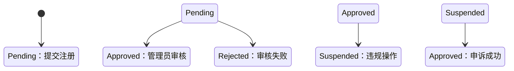
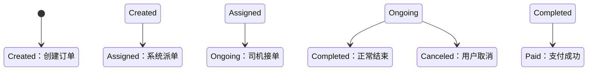

# 网约车系统后台管理需求分析

## 1. 概述

本项目为简化版网约车系统后台管理，采用Go语言后端，PostgreSQL存储，Redis缓存，React（管理员Web端）和Taro+React（客户/司机小程序端）作为前端。系统集成百度/高德地图API及微信支付，涵盖用户注册登录、车辆信息管理、订单创建与派发、评价管理等核心功能，并实现RBAC权限控制。

## 2. 需求列表及细节

### 2.1 用户注册与登录

#### 需求 1.1：用户注册/登录
- **功能描述**：客户通过微信快速注册/登录
- **输入**：
  - `code` (微信临时凭证，必填)
  - `encryptedData` (加密用户数据，必填)
  - `iv` (解密向量，必填)
- **输出**：
  - 成功：`{ token: <JWT>, user_id: <ID>, role: customer }`（有效期2小时）
  - 失败：`{ error: "微信授权失败"， code: 401 }`
- **权限控制**：开放接口

#### 需求 1.2：司机注册
- **功能描述**：用户注册司机需提交驾驶证信息，系统自动验证
- **输入**：
  - `license_number` (驾驶证编号，必填，唯一)
  - `license_image` (驾驶证照片，Base64格式或URL)
- **输出**：
  - 验证通过：`{ status: "pending", driver_id: <ID> }`
  - 验证失败：`{ error: "驾驶证验证失败"， details: <失败原因> }`
- **权限控制**：需已登录用户JWT

#### 需求 1.3：管理员登录
- **功能描述**：预置管理员账号登录
- **输入**：
  - `phone` (手机号，必填)
  - `password` (密码，必填)
- **输出**：
  - 成功：`{ token: <JWT>, user_id: <ID>, role: admin }`
  - 失败：`{ error: "认证失败"， code: 401 }`
- **权限控制**：仅管理员角色可访问后台

### 2.2 车辆信息管理

#### 需求 2.1：司机提交/修改车辆
- **功能描述**：审核通过司机添加/更新车辆信息
- **输入**：
  - `plate_number` (车牌号，必填，唯一)
  - `vehicle_type` (车型，必填)
  - `registration_image` (行驶证照片)
- **输出**：
  - 成功：`{ vehicle_id: <ID>, status: "pending", verify_status: "verifying" }`
  - 失败：`{ error: "车牌号已存在" }`
- **权限控制**：仅`approved`状态司机

#### 需求 2.2：管理员审核车辆
- **功能描述**：管理员审核车辆信息
- **输入**：
  - 查询：`status=pending|approved|rejected`（可选）
  - 审核：`vehicle_id`（必填）, `action=approve|reject`（必填）
- **输出**：
  - 查询：`[ { id, driver_id, plate_number, status } ]`
  - 审核：`{ status: "approved|rejected" }`
- **权限控制**：仅管理员角色

### 2.3 订单管理

#### 需求 3.1：创建订单
- **功能描述**：客户创建实时/预约订单
- **输入**：
  - `start_location` (起点坐标{lat,lng}，必填)
  - `end_location` (终点坐标{lat,lng}，必填)
  - `book_time` (预约时间，ISO格式，可选)
- **输出**：
  - 成功：`{ order_id, routes: [ {route_id, distance, duration} ], status: "created" }`
  - 失败：`{ error: "无效坐标" }`

#### 需求 3.2：智能派单
- **功能描述**：系统自动/手动派单
- **输入**：
  - `order_id` (必填)
  - 司机设置：`auto_accept` (布尔值，取自司机表)
- **输出**：
  - 自动派单：推送给司机
  - 手动接单：`[ {driver_id, distance, rating} ]`（按距离排序）
- **权限控制**：系统自动或司机手动接单

#### 需求 3.3：预约单处理
- **功能描述**：预约订单动态派单
- **输入**：
  - `order_id` (必填)
  - `book_time` (必填)
- **输出**：
  - 触发派单时同实时订单
- **特殊逻辑**：逾期订单优先级提高

#### 需求 3.4：查看订单
- **功能描述**：多角色查看订单
- **输入**：
  - `user_id` (客户/司机ID，可选)
  - `status` (订单状态，可选)
  - `date_range` (日期范围，可选)
- **输出**：
  - `[ { id, customer_id, driver_id, start, end, status, actual_route } ]`
- **权限控制**：
  - 客户：仅自己订单
  - 司机：仅接单订单
  - 管理员：所有订单

#### 需求 3.5：地图整合
- **功能描述**：地图API集成
- **输入**：
  - `order_id` (订单ID，必填)
- **输出**：
  - 实时位置：`{ driver_location: {lat,lng} }`
  - 路线详情：`{ path: [ {lat,lng} ], distance, duration, toll_fee }`

### 2.4 评价管理

#### 需求 4.1：客户评价
- **功能描述**：完成订单后评价
- **输入**：
  - `order_id` (必填)
  - `rating` (1-5，必填)
  - `comment` (评论，可选)
- **输出**：
  - 成功：`{ review_id: <ID> }`
  - 失败：`{ error: "订单未完成" }`
- **约束**：仅`completed`状态订单

#### 需求 4.2：微信支付
- **功能描述**：订单微信支付
- **输入**：
  - `order_id` (必填)
- **输出**：
  - 成功：`{ payment_url: "weixin://..." }`
  - 失败：`{ error: "订单未完成" }`
- **回调逻辑**：支付成功更新为`paid`状态

#### 需求 4.3：查看评价
- **功能描述**：评价查询
- **输入**：
  - `driver_id` (司机ID，可选)
  - `page` (页码，默认1)
  - `page_size` (页大小，默认10)
- **输出**：
  - `{ reviews: [ {id, order_id, rating, comment} ], total_count }`
- **权限控制**：
  - 司机：仅自己评价
  - 管理员：所有评价

### 2.5 信息查询与统计

#### 需求 5.1：管理员查询
- **功能描述**：多条件数据查询
- **输入**：
  - 用户：`role`, `status`, `register_date`
  - 车辆：`status`
  - 订单：`status`, `date`, `user_id`
- **输出**：
  - 对应实体列表
- **权限控制**：仅管理员

#### 需求 5.2：基础统计
- **功能描述**：核心业务指标统计
- **输入**：
  - `date` (日期，默认当天)
- **输出**：
  - `{ orders: 100, revenue: 1000, active_users: 50, active_drivers: 20 }`
- **计算逻辑**：
  - 收入 = 订单数 × 10元
  - 活跃用户 = 当日下单用户数

### 2.6 用户权限管理

#### 需求 6.1：角色权限控制
- **RBAC模型**：
  ```mermaid
  graph TD
    A[客户] --> B[创建订单]
    A --> C[支付]
    A --> D[评价]
    E[司机] --> F[管理车辆]
    E --> G[接单]
    E --> H[查看评价]
    I[管理员] --> J[数据管理]
    I --> K[审核]
    I --> L[统计分析]
  ```

#### 需求 6.2：司机收入提现（UI占位）
- **功能描述**：提现功能入口
- **输入**：无
- **输出**：`{ status: "success" }`（模拟）
- **权限控制**：仅司机角色

### 2.7 异常处理

#### 需求 7.1：基本异常捕获
- **错误响应**：
  ```json
  {
    "error": "错误描述",
    "code": 500,
    "request_id": "唯一追踪ID"
  }
  ```
- **日志格式**：`[时间] [级别] [路由] [错误详情]`

#### 需求 7.2：纠纷处理
- **功能描述**：订单纠纷标记
- **输入**：
  - `order_id` (必填)
  - `dispute_type` (complaint|lost_item，必填)
- **输出**：
  - `{ is_disputed: true, dispute_type: <类型> }`
- **权限控制**：管理员处理

#### 需求 7.3：订单预警
- **功能描述**：路线偏离预警
- **触发条件**：
  ```python
  if deviation > 5km and speed > 60km/h: level=3
  elif deviation > 2km: level=2
  else: level=1
  ```
- **输出**：推送`{ order_id, level, message }`至管理员
- **权限控制**：仅管理员可见

## 3. 非功能性需求增强

### 安全强化措施
1. **通信安全**：
   - 所有API强制HTTPS
   - 敏感数据（密码/证件号）传输前AES加密
   
2. **数据安全**：
   - 管理员密码：bcrypt加密存储
   - 支付信息：PCI DSS合规处理
   - GDPR兼容：6个月自动清除未激活用户数据

### 性能优化指标
| 场景 | 目标响应时间 | 负载能力 |
|------|-------------|---------|
| 用户登录 | <300ms | 1000 TPS |
| 订单创建 | <500ms | 500 TPS |
| 实时定位 | <100ms | 10,000 QPS |

### 可维护性改进
1. **架构规范**：
   ```
   /src
     /controllers  # API控制器
     /services     # 业务逻辑
     /models       # 数据模型
     /middleware   # RBAC中间件
   ```

2. **文档标准**：
   - Swagger OpenAPI 3.0规范
   - Postman测试集合
   - 架构决策记录（ADR）

### 可测试性增强
| 测试类型 | 覆盖率目标 | 关键测试点 |
|---------|-----------|------------|
| 单元测试 | 80%+ | 派单算法、JWT验证 |
| 集成测试 | 主要流程 | 完整订单生命周期 |
| E2E测试 | 核心路径 | 注册-下单-支付流程 |

## 4. 关键优化建议

### 状态机明确定义
**司机状态流转**：


**订单状态模型**：


### 扩展能力建议
1. **动态定价**：
   ```go
   func CalculatePrice(distance, duration, tollFee float64) float64 {
       base := 10.0
       return base + (distance * 2.5) + (duration * 0.5) + tollFee
   }
   ```

2. **通知系统**：
   - 订单状态变更时推送小程序消息
   - 关键操作发送短信确认（如提现申请）

3. **司机调度算法**：
   ```python
   def driver_score(driver):
       return (driver.rating * 0.6 + 
               (1 - driver.distance/MAX_DISTANCE) * 0.3 +
               driver.acceptance_rate * 0.1)
   ```

### 技术实施建议
1. **Go层优化**：
   - 使用`go-redis`进行司机位置缓存：
     ```go
     err := rdb.GeoAdd(ctx, "drivers", &redis.GeoLocation{
         Name: driverID,
         Longitude: lng,
         Latitude: lat,
     }).Err()
     ```

2. **PostgreSQL优化**：
   - JSONB字段存储动态数据：
     ```sql
     CREATE TABLE orders (
         id SERIAL PRIMARY KEY,
         route JSONB NOT NULL
     );
     ```

3. **前端集成**：
   ```jsx
   // 小程序端地图组件
   <Map 
     longitude={driverPos.lng}
     latitude={driverPos.lat}
     polyline={currentRoute}
   />
   ```

## 5. 待确认事项
1. **计价规则确认**：
   - ☐ 固定10元
   - ☐ 动态计价（里程+时长）

2. **通知机制范围**：
   - ☐ 仅关键状态变更
   - ☐ 全流程推送

3. **测试账户要求**：
   | 角色 | 数量 | 预置数据 |
   |------|-----|----------|
   | 客户 | 5 | 历史订单 |
   | 司机 | 3 | 车辆信息 |
   | 管理员 | 2 | 全权限 |

## 6. 风险评估
| 风险点 | 可能性 | 影响 | 缓解措施 |
|-------|--------|------|---------|
| 地图API配额超限 | 中等 | 高 | 多服务商熔断切换 |
| 支付回调失败 | 低 | 严重 | 对账补偿机制 |
| 证件验证服务宕机 | 低 | 中 | 切换人工审核模式 |